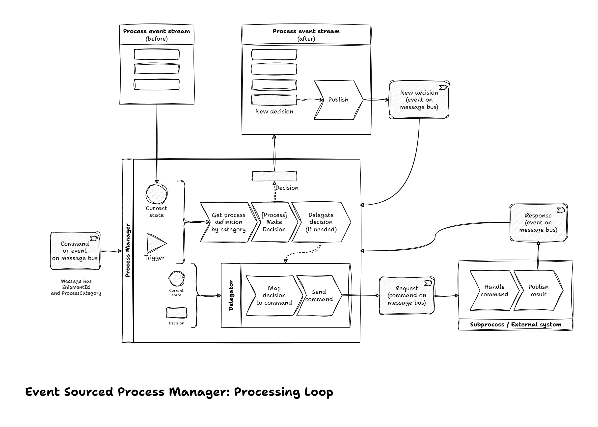

# Event Sourced Process Manager

## Overview

When implementing a long-running business processes, one option to do it
is to use a state machine. There may be a few concerns about that:
* If state machine persists its state to e.g. a SQL database and uses CRUD
  operations, it may be difficult to see how we got into a given state
* If a business process is long-running, we may need to change the process
  rules in the middle of a process (e.g. new legal regulations are introduced
  that make pending process definition not valid anymore). This can make it
  difficult to switch from one state machine to another while keeping internal
  state consistent

Alternative approach to that is to use Event Sourcing, where each decision
made in a process is explicitly recorded into the process' event stream.

A process state is a simple fold of those events, and at any point when
the process manager needs to make a decision (based on some kind of a trigger -
e.g. an external message or passage of time), we produce a new process decision
event and add it to the process event stream.

Worth noting that the process decision events are just that - they are only
records of decisions we made and no actual actions are taken by the process
manager itself, it delegates these responsibilities to other components
(typically that would be another aggregate).

This solution explores an option of building event-sourced process manager
using .NET/C#.

It uses "ports and adapters" (a.k.a. hexagonal architecture)
approach; *Event Store* and *Message Bus* concepts are encapsulated in
respective Ports, and there are Adapters for actual implementation.
This solution uses [MassTransit](https://masstransit.io/) /
[RabbitMQ](https://rabbitmq.com/) for the underlying message bus implementation,
and [Marten](https://martendb.io/) / [PostgreSQL](https://www.postgresql.org/)
for the underlying EventStore implementation.

## Business Domain

In this solution we will be using shipment business domain.

Key concepts:
* We are assuming that we will be using multiple *Carriers* to complete the
  *Shipment* journey, to optimise the cost
* *Shipment*: description of goods being sent, and information about what
  carriers we are using
* *Shipment Leg*: an individual leg in a *Shipment* journey; defines what
  carrier we are using for this leg, package(s) content / dimensions / weight
  (not covered in this example), when shipment package(s) expected to enter the
  carrier network, and *Shipper* / *Receiver* / *Collection* details
* *Shipment Process Outcome*: if the process was successful, we expect to have
  tracking number(s) for each shipment leg, collection booking reference
  (if collection booking is required), and set of shipment documents

A business requirements may look like this:
* Validate user input
* Decide on what kind of shipment it is (domestic or international, do we need
  to worry about customs etc.); this defines what type of process will be used
* For domestic shipments (it most likely will imply that shipment has a single
  leg)
  * manifest shipment with carrier; at this point we will have
    tracking number(s) allocated by the carrier
  * generate PDF with all the labels customer would need to print and attach to
    package(s), and perhaps also include other relevant documents
  * book shipment collection with carrier (often this is a separate operation
    as far as a carrier is concerned, but this detail may or may not be exposed
    to an end user)
* For international shipments process may look similar to the above, but we may
  need to also generate a customs invoice

## Solution Components

* *Shipment Process* - orchestrates the process as a whole
* *Manifestation and Documents* - handles shipment manifestation and
  documents generation
* *Collection Booking* - handles shipment collection booking
  scheduling and the collection booking itself
* *Carrier Integration* - component that uses carrier APIs to manifest shipment
  or book shipment collection, using carrier-specific APIs. This solution is not
  focusing on the carrier integration aspect, we assume that this is implemented
  in a supporting bounded context we can communicate with using messages, and
  the solution uses a simple stub representing that supporting bounded context.

Major process steps and the way how they are composed into a complete process
is the responsibility of *Shipment Process* orchestrator,
*Manifestation and Documents* and *Collection Booking* implement individual
steps functionality.

### Shipment Process

This part of the system is only responsible for making decision about what step
to invoke next. Actual steps implementation is delegated to
*Manifestation and Documents* or *Collection Booking*.

We may have different versions of overall shipment process, as business
requirements will likely evolve over time, and business may need to
differentiate between domestic and import/export shipments or have different
versions of a process for different types of customers etc.

It may or may not be a business requirement to have multiple versions of
shipment process running at the same, however having a technical ability to
do so is useful for internal purposes, to make it easier to manage changes in
shipment process and allow pending processes (e.g. those waiting for
collection booking) to finish as they are.

Process initialization:


Main processing loop:



#### Saga vs Process Manager

In theory, *Manifestation and Documents Aggregate* and
*Collection Booking Aggregate* events and/or state may provide enough
information to make decision what step to invoke next, so we could consider
using a saga (i.e. stateless approach as far as overall process is concerned),
however we may want to record what has happened process-wise, at least to
be able to see more easily where we are in the overall process and track more
coarse-grained stages *Manifestation and Documents Aggregate* and
*Collection Booking Aggregate* are not aware about.

This solution uses Process Manager approach and tracks the state of the overall
process explicitly.

### Manifestation and Documents

*Manifestation and Documents* component is mostly passive - it is driven by
commands sent from *Shipment Process* orchestrator. The only exception to this
is handling manifestation for multiple shipment legs - it is implemented
internally in *Manifestation and Documents* (by reacting to
*Carrier Integration* events) so that from orchestrator's point of view whole
shipment manifestation is a single operation.

Manifestation implementation, i.e. calling carrier APIs is delegated to
*Carrier Integration*, but we have internal representation of those events
stored in *Manifestation and Documents* event stream.

### Collection Booking

*Manifestation and Documents* component is driven by commands sent from
*Shipment Process* orchestrator, but it may also react to passage of time
events to initiate collection booking with carrier (passage of time
events handling, and scheduling aspect in general is not covered in this
example).

Collection booking implementation, i.e. calling carrier APIs is delegated to
*Carrier Integration*, but we have internal representation of those events
stored in *Collection Booking* event stream.

## Running the Solution

Assuming that .NET 8 SDK, PowerShell Core 7, and Docker with Docker Compose
plugin are installed.

Start the infrastructure and application in Docker Compose:

```bash
./build.ps1 DockerCompose.Start
```

Trigger the process (use example below as-is or use a random guid for
shipment id).

```bash
http post http://localhost:43210/{shipmentId}
```

To emulate various aspects of the process, this solution uses shipment id:

* Shipment process classification:
  * guid starting with `1` triggers domestic process (`domestic-1.0`)
  * otherwise international process (`international-1.0`) is used
* Failures handling:
  * guid ending with `1` triggers process that fails at manifestation stage
  * guid ending with `2` triggers process that fails at collection booking stage
  * guid ending with `3` triggers process that fails at collection booking stage
    but a few seconds later collection booking will be retried (this emulates
    rebooking initiated by customer or customer support agent) and collection
    booking will complete successfully, so the overall process will transition
    from Failed to Completed
  * otherwise the process should complete successfully straight away

Example:

```bash
http post http://localhost:43210/15916b8a-5d11-456f-9934-ed91c2bd82c0
http post http://localhost:43210/15916b8a-5d11-456f-9934-ed91c2bd82c1
http post http://localhost:43210/15916b8a-5d11-456f-9934-ed91c2bd82c2
http post http://localhost:43210/15916b8a-5d11-456f-9934-ed91c2bd82c3

http post http://localhost:43210/c7de2c4a-dded-47de-8d24-564d7ade3e20
http post http://localhost:43210/c7de2c4a-dded-47de-8d24-564d7ade3e21
http post http://localhost:43210/c7de2c4a-dded-47de-8d24-564d7ade3e22
http post http://localhost:43210/c7de2c4a-dded-47de-8d24-564d7ade3e23
```

Observe events in MartenDB/Postgres:

```sql
select * from mt_events
where stream_id = 'Process_15916b8a-5d11-456f-9934-ed91c2bd82c0'
order by version;

select * from mt_events
where stream_id = 'Shipment_15916b8a-5d11-456f-9934-ed91c2bd82c0'
order by version;

select * from mt_events
where stream_id = 'Collection_15916b8a-5d11-456f-9934-ed91c2bd82c0'
order by version;
```

*Shipment Process* event stream example:


*Manifestation and Documents* event stream example:


*Collection Booking* event stream example:


Get shipment process outcome via API:

```bash
http get http://localhost:43210/15916b8a-5d11-456f-9934-ed91c2bd82c0
```
```json
{
    "collectionBookingReference": "9064d784528640888cbc5a244e08814f",
    "collectionDate": "2024-02-05",
    "documents": {
        "combinedDocument": "https://shipment-documents.net/15916b8a-5d11-456f-9934-ed91c2bd82c0/combined-document",
        "customsInvoice": null,
        "labels": "https://shipment-documents.net/15916b8a-5d11-456f-9934-ed91c2bd82c0/labels",
        "receipt": "https://shipment-documents.net/15916b8a-5d11-456f-9934-ed91c2bd82c0/receipt"
    },
    "processCategory": "domestic-1.0",
    "shipmentId": "15916b8a-5d11-456f-9934-ed91c2bd82c0",
    "timeZone": "Europe/London",
    "trackingNumbers": "211cc3fc4c7a436f8c07be7480b7aae8"
}
```


## Conclusions

### Pros

* Process decisions are explicitly recorded in process manager event stream,
  this makes it is easy to review process history
* By using event sourced approach, process manager state mutations are separated
  from making process decisions; this leads to a better separation of concerns
  and makes decision logic implementation more clear
  * Domain aggregates only return events
* Proposed solution is good from maintainability point of view:
  * There are only two files that define the overall process:
    `IShipmentProcess` implementation (e.g. `DomesticShipmentProcessV1`)
    and `ShipmentProcessDelegator`, so it is easy to follow the steps
    connections
  * Message consumers for the process triggers are completely separated
    from the process manager logic
  * Clear separation of delegating decisions responsibilities from top level
    process to sub-processes and the logic that makes those decisions
  * Decision-making is easy to test using unit tests
* No magic - implementation does not use any 3rd party libraries to
  define a process

### Cons

* `IShipmentProcess` implementation (e.g. `InternationalShipmentProcessV1`) file
  can be large and complicated, however it is still manageable, and we have a
  single place to look at when we need to understand processing logic
* Having multiple events related to the same process consumed in quick
  succession (e.g. `ShipmentProcessStarted` event is immediately followed by
  `ManifestationAndDocumentsStarted` event) may cause concurrency issues -
  if event representing process manager decision is published on the message bus
  before it is stored into event stream, that will trigger another consumer
  (potentially in a different K8s pod if we use horizontal scaling) that will
  access the same shipment process event stream. This can lead to overlapping
  transactional boundaries in two consumers running at the same time.
  This example uses policy to publish events *after* they have been committed
  to the event stream, but this can lead to another class of issues.
  "At least once" vs "at most once" message delivery policy is out of the scope
  of this example, but it should be considered carefully in a real application.
  Using transactional Outbox and Inbox pattern in conjunction with the
  event sourced process manager may help alleviate these issues.

### Aspects not covered in the solution but worth considering

* This example does not implement guards against a case when trigger events are
  not applicable for current process state (although there is a
  [comment](https://github.com/iblazhko/eventsourced-processmanager/blob/main/src/EventSourcedPM.Application/Orchestration/Processes/InternationaShipmentProcessV1.cs#L18-L90)
  describing how it can be implemented). This is not trivial, a real process
  definition may need to allow restarts of some stages, e.g. to
  re-generate documents.
* This example does not implement steps timeout. If e.g. manifestation command
  failed in *Carrier Integration* but we have not received failure event in
  *Shipment Process* orchestrator, process will stop indefinitely.
  Real application would need some kind of mechanism to fail the process
  if we do not receive expected events after some time.
* This example does not implement any correcting actions in case of failures.
  E.g. when we have two leg shipment and one leg was manifested successfully
  but the other leg manifestation failed, we may want to consider cancelling
  manifestation of the other leg. This is out of the scope for this example
  that is focusing on the general process manager design, but it is something
  that should be considered in a real application.
* Real application may consider better isolation of
  *Manifestation and Documents Aggregate* and *Collection Booking Aggregate*,
  e.g. extracting them into separate microservices.
* It is assumed that individual steps implementation is relatively stable, so
  that when we introduce a new version of a process or a new process category,
  we can reuse existing steps.
* This example does not provide any suggestions about testing strategy in a
  real application. 
* This solution does not have an explicit projection (view model) of a process
  state. In this solution this was done for the sake of simplicity, but in a
  real application we may consider such a projection (view model), e.g. to
  optimize performance of "get current state representation to a user / admin"
  operation.
* In this solution, process category that defines what process implementation
  is used, is supposed to stay the same for the lifetime of the process.
  In a real application we may need to consider switching an *existing* process
  to a new process definition. This implementation allows that in principle,
  technically that would mean publishing a process event
  `ProcessCategoryChanged` with a new `ProcessCategory` value.
  Next event handler will use corresponding implementation.

## References

1. <https://abdullin.com/post/ddd-evolving-business-processes-a-la-lokad/>
2. <https://thinkbeforecoding.com/post/2021/12/17/functional-event-sourcing-decider>
3. <https://blog.bittacklr.be/the-workflow-pattern.html>
